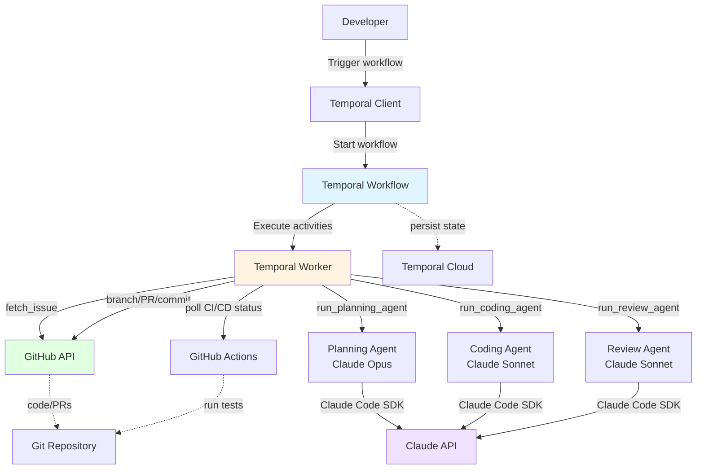

# System Architecture

## Overview

An autonomous GitHub issue resolution system that uses specialized AI agents (Planning, Coding, Review) orchestrated by Temporal workflows to implement low-priority issues end-to-end. Long-running workflows iterate based on CI/CD feedback until completion or human escalation.

## Requirements Summary

### Functional

1. **Issue-to-Implementation Pipeline**: Analyze issue → generate plan → implement code → review changes → commit → monitor CI/CD → iterate
2. **Intelligent Failure Handling**: Categorize CI/CD failures (code vs environment), auto-fix retryable issues, escalate blockers to humans
3. **Resilient State Management**: Support workflows running days/weeks/months with continue-as-new pattern, resume work after interruptions without repetition
4. **Multi-Agent Orchestration**: Coordinate specialized agents (Planning/Coding/Review) with state passing through Temporal workflow
5. **Work Detection & Adaptation**: Planning agent detects existing commits/changes and adjusts plan accordingly on workflow restart

### Non-Functional

| Category | Requirement | Target |
|----------|-------------|--------|
| Scale | Concurrent workflows | 100+ |
| Throughput | Issues per week | 1,000+ |
| Performance | Workflow trigger latency | Low (seconds) |
| Performance | Agent timeouts | Planning: 10m, Coding: 20m, Review: 10m |
| Availability | Uptime | POC - no hard target |
| Consistency | State management | Temporal Cloud (accept downtime) |
| Security | Data sensitivity | Internal only, no secrets in payloads |
| Cost | Primary driver | LLM API calls (~$5-10 per workflow) |

## Capacity Estimates

```
Workflows:
- 100 concurrent capacity
- 1,000 issues/week = ~143/day
- ~2 hours average per workflow
- Peak: ~70 concurrent (under capacity)

LLM API Calls per Workflow:
- Planning: 1-3 calls (Opus)
- Coding: 5-100 calls (Sonnet, varies by complexity)
- Review: 1-5 calls (Sonnet)
- Total: ~10-100+ calls per workflow

Cost Estimate:
- Planning: ~$0.50/workflow
- Coding: ~$4.00/workflow
- Review: ~$0.15/workflow
- Total: $5-10 per workflow
- At 1,000 issues/week: $5,000-10,000/week in LLM costs
```

## Core Entities

```
Workflow: Long-running orchestration from trigger to PR merge
Issue: GitHub issue being resolved
Plan: Structured implementation plan with steps and progress tracking
Commit: Code changes with internal review feedback
PullRequest: GitHub PR with status and CI/CD results
CICDRun: GitHub Actions workflow run with categorized results
Agent: Specialized Claude instances (Planning/Coding/Review)

Relationships:
Workflow ──1:1──▶ Issue ──1:1──▶ Plan ──1:N──▶ Commit
Workflow ──1:1──▶ PullRequest ──1:N──▶ CICDRun
Workflow ──1:3──▶ Agent (planning, coding, review instances)

Access Patterns:
Workflow: Write-heavy (state updates on every activity)
Plan: Write-once, read-many (created once, referenced throughout)
Commit: Write-heavy (created on each iteration)
CICDRun: Read-heavy (polled every 5 minutes)
```

## System Design



**Key Flow:**

1. User triggers workflow via Temporal Client (repo + issue number)
2. Workflow executes activities through Worker: fetch issue → run planning agent → run coding agent → run review agent → commit/push → poll CI/CD
3. On CI/CD failure: categorize (code vs environment) → retry or escalate
4. On CI/CD success: check if work complete → iterate or finish
5. Continue-as-new every 24 hours or when history size large

## Key Interfaces

| Interface | Type | Purpose |
|-----------|------|---------|
| Workflow Trigger | Temporal Client API | Start workflow with `{repoOwner, repoName, issueNumber, targetBranch?}` |
| GitHub API | REST/GraphQL | Issue retrieval, branch/PR management, Actions status monitoring |
| Claude API | Claude Code SDK | Execute Planning (Opus), Coding (Sonnet), Review (Sonnet) agents |
| Temporal Activities | Python functions | `fetch_issue`, `run_*_agent`, `commit_and_push`, `create_pr`, `monitor_cicd`, `update_pr` |
| Agent Context | Workflow state | Agents communicate via activity inputs/outputs (serialized through Temporal history) |

## Operational Considerations

| Concern | Approach |
|---------|----------|
| Monitoring | No metrics tracking for POC; rely on Temporal Cloud UI for workflow status |
| Resilience | Intelligent retries via Temporal: infinite retries for transient API errors, scrutinize LLM retries (don't infinitely retry 429s), escalate after N failed CI/CD fix attempts |
| Failure Handling | Code failures (build/test/lint) → auto-retry; Environment failures (permissions, missing env vars, pipeline issues) → escalate to human, pause until fixed |
| CI/CD Monitoring | Poll every 5 minutes (optimize later); no webhooks for simplicity |
| Continue-as-New | Trigger every 24 hours (even if idle) + when history size large; carry forward all relevant state |
| Work Resumption | Planning agent detects existing work by examining: source code, commits, PR comments, CI/CD history, previous plan; adjusts plan to avoid repetition |
| Deployment | Local Temporal workers initially, containerized later; skip deployment considerations for POC |
| Cost Optimization | Conservative agent timeouts, no infinite LLM retries on rate limits, avoid repeating work via continue-as-new |

## Deep Dive: CI/CD Feedback Loop

**Challenge**: Distinguish retryable code failures from non-retryable environment failures to prevent infinite retry loops and excessive LLM costs.

**Approach**:

- **Code Failures (retryable)**: Build errors, test failures, lint errors - anything fixable by changing source code
  - Coding agent attempts fix with review feedback → commit → re-test
  - After N failed attempts, escalate to human with specific error details
- **Environment Failures (non-retryable)**: Missing env vars, pipeline permissions, infrastructure issues
  - Assumption: CI pipeline correctly configured unless task is to change pipeline itself
  - Immediately escalate to human with actionable PR comment
  - Agent pauses until human marks issue resolved
- **State Synchronization**: Every iteration, pull latest code from branch before planning/coding (human may have pushed fixes)

**Trade-off**: Requires intelligent error categorization logic vs simpler "always retry" approach; saves costs and prevents infinite loops but adds complexity.

## Deep Dive: Agent State Management & Continue-as-New

**Challenge**: Support unbounded workflow duration (days/weeks/months) while avoiding Temporal history growth limits and enabling resilient work resumption.

**Approach**:

- **Continue-as-New Triggers**: Every 24 hours (even if idle) OR when history size exceeds threshold
- **State Carryforward**: Workflow state (plan, commits, PR number, CI/CD results, current step) serialized and passed to new workflow execution
- **Work Detection on Resume**: Planning agent examines:
  1. Source code in feature branch (what's implemented?)
  2. Existing commits (what work was done? commit messages tell story)
  3. PR description and comments (human feedback or context?)
  4. Previous plan from workflow state (original intent)
  5. CI/CD failure history (what approaches failed?)
  6. Diff between branch and base (concrete changes)
- **Plan Adjustment**: Planning agent says "I see X implemented, Y failing, so I'll focus on fixing Y and completing Z" - avoids repeating work

**Trade-off**: More complex planning logic vs simpler "start from scratch" approach; enables true long-running workflows and human collaboration but requires sophisticated context detection.

## Architectural Decisions

| Decision | Choice | Trade-off |
|----------|--------|-----------|
| Agent Architecture | Separate Claude instances per role (Planning/Coding/Review) | Specialization and clear concerns vs more orchestration complexity |
| State Management | Temporal workflow state only (no external DB) | Simpler architecture, single source of truth vs limited query capabilities for analytics |
| CI/CD Monitoring | Polling every 5 minutes | No infrastructure setup (webhooks) vs slightly higher latency |
| Failure Categorization | Smart categorization (code vs environment) | Prevents infinite retries, lower cost vs requires error parsing logic |
| Continue-as-New | Time-based (24h) + history-based | Predictable behavior, bounded history vs more frequent state transitions |
| Work Resumption | Planning agent detects and adapts | Resilient to restarts and human intervention vs more complex planning |
| Agent Execution | Same process as Temporal worker | Simpler deployment, fewer moving parts vs potential worker resource contention |
| Cost Optimization | Conservative timeouts, limited LLM retries | Lower costs, faster failure detection vs potentially lower success rate |
| Language | Python | Solo developer familiarity, Temporal SDK support vs N/A |
| Deployment | Local workers → containers later | Faster iteration for POC vs deferred production concerns |

## Future Considerations

- **Multi-PR Orchestration (V2)**: Break complex issues into dependent PRs, manage sequence automatically
- **Human-in-the-Loop Feedback (V2)**: Incorporate PR comments from developers during workflow execution
- **Automatic Issue Selection (V3)**: Prioritize and select issues from backlog based on complexity/labels
- **Analytics Dashboard (V3)**: Track completion rates, time-to-resolution, cost per issue, ROI metrics
- **Workflow Versioning**: Handle code changes while workflows in-flight (deferred)
- **CI/CD Optimization**: Smarter polling (exponential backoff), webhook support (if infrastructure allows)
- **Language-Specific Tuning (V3)**: Optimize prompts and patterns based on observed success/failure modes

---

**Last Updated:** 2025-12-31
**Status:** Architecture Definition Complete
**Owner:** Solo Developer (POC)
